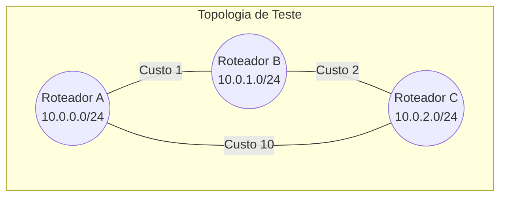
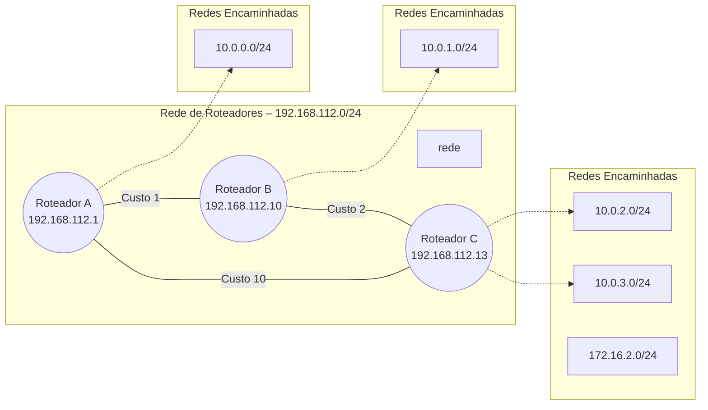
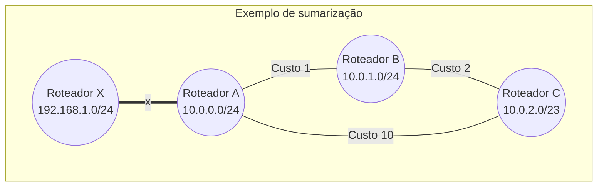

# Implementando o Protocolo de Roteamento Vetor de Distância

Nesta atividade, vocês implementarão um dos algoritmos que movem a internet: o **Vetor de Distância (Distance Vector)**. Este é o algoritmo que serviu de base para protocolos reais como o **RIP (Routing Information Protocol)**.

Nosso objetivo é construir um "roteador" em Python que seja capaz de descobrir a topologia de uma rede e tomar decisões inteligentes sobre o melhor caminho para encaminhar dados, tudo isso através da troca de mensagens com seus vizinhos. Para tornar o desafio ainda mais interessante e realista, vocês também implementarão uma técnica de otimização: a **sumarização de rotas**.

Cada grupo irá trabalhar em no seu roteador, utilizando o código base em Python. Este roteador é, na verdade, um servidor web implementado com a biblioteca Flask.

*   **Comunicação:** Em vez de pacotes em nível de bits, nossos roteadores se comunicarão trocando informações de rota através de uma API REST simples (usando requisições HTTP).
*   **Topologia:** A configuração da rede (quem são os vizinhos de cada roteador e o "custo" do link para alcançá-los) será definida em arquivos de configuração `.csv` e `json` externos. Isso nos permite simular qualquer topologia de rede que quisermos.
*   **Algoritmos:**  Utilizaremos algoritmo de Bellman-Ford para atualizar as rotas e a lógica de sumarização para otimizar os anúncios.


**Toc**:
> 1. [A Estrutura do Roteador](#a-estrutura-do-roteador)
>    - [O Formato da Mensagem](#o-formato-da-mensagem)
> 1. [Roteiro de Implementação](#seu-roteiro-de-implementação)
> 1. [Cenário de Exemplo](#cenário-de-exemplo)
> 1. [Desafios de Implementação](#desafios)
> 1. [Avaliação](#avaliação)
>    - ⚠️ [Datas dos entregaveis](#resumo-entregaveis)


## A Estrutura do Roteador

Vocês receberão um código Python base com parte de inicialização do servidor e leitura dos arquivos. O seu roteador terá dois *endpoints* (rotas) para troca de informação com o mundo externor:

*   `POST /receive_update` (**Metodos de atualização**): Esta é a rota que escuta as mensagens de atualização dos roteadores vizinhos. A maior parte da lógica do Vetor de Distância será implementada aqui.
*   `GET /routes`: Vocês implementarão esta rota. Este metodo server para verificar o estado do seu roteador, exibindo a tabela de roteamento atual em formato JSON. Servindo como uma ferramenta de depuração.

Em suma, o metodo `/receive_update`, recebera a notificação sempre que um roteador vizinho tiver a sua tabela de roteamento atualizada.

> ⚠️ Lembrando que esses metodos serão utilizados utilizados por outros grupos e devem ser implementados com as assinaturas padrões. 

### O Formato da Mensagem

Para que a comunicação funcione entre todos os grupos, é **importante** que as mensagens de atualização trocadas sigam um formato padrão. Qualquer desvio fará com que seu roteador não seja compatível com os outros.

Toda requisição `POST` enviada para `/receive_update` deve ter um corpo em JSON com a seguinte estrutura:

```json
{
  "sender_address": "127.0.0.1:5001",
  "routing_table": {
    "10.0.2.0/24": { "cost": 0, "next_hop": "10.0.2.0/24" },
    "10.0.1.0/24": { "cost": 1, "next_hop": "127.0.0.1:5000" },
    "10.0.3.0/24": { "cost": 2, "next_hop": "127.0.0.1:5002" }
  }
}
```

*   `sender_address` (string): O endereço e a porta do roteador que enviou a mensagem. Você usará isso para saber de qual vizinho a atualização veio e qual o custo do link direto para ele.
*   `routing_table` (objeto): Um objeto que representa a tabela de roteamento do remetente.
    *   As **chaves** são as redes de destino (strings no formato "ip/prefixo").
    *   Os **valores** são outro objeto com duas chaves: `cost` (um número) e `next_hop` (uma string).


> ⚠️ Repare que o curso zero ("cost": 0) indica que a rede esta **diretamente conectada** ao roteador!


Para testar que sua menssagem esta funcionando vocês podem utilizar o comnado curl abaixo (testado no linux).

```bash
curl -X POST http://localhost:5001/receive_update \
  -H "Content-Type: application/json" \
  -d '{
    "sender_address": "127.0.0.21:5021",
    "routing_table": {
      "10.0.2.0/24": { "cost": 0, "next_hop": "10.0.2.0/24" },
      "10.0.1.0/24": { "cost": 1, "next_hop": "127.0.0.1:5000" },
      "10.0.3.0/24": { "cost": 2, "next_hop": "127.0.0.1:5002" }
    }
  }'
```


## Roteiro de Implementação

O código-base fornecido contém comentários `TODO:` onde vocês podem adicionar sua lógica, lembrando que o local do comentario é um sugestão vocês podem alterar o codigo como desejarem. Segue a recomendação de passos de implementação:

**Passo 1: Inicialize sua Tabela de Roteamento**

No método `__init__` da classe `Router`, sua primeira tarefa é criar e popular a tabela de roteamento. Ela deve conter:
1.  A rota para a rede que seu roteador administra diretamente (vinda do argumento `--network`). O custo para uma rede diretamente conectada é **0**.
2.  As rotas para seus vizinhos diretos (vindos do arquivo `.csv`). O custo é o custo do link, e o `next_hop` é o próprio endereço do vizinho.

**Passo 2: Receba e Processe Atualizações (Lógica de Bellman-Ford)**
No método `receive_update`, você implementará o coração do algoritmo.
1.  Extraia a `sender_address` e a `routing_table` do JSON recebido.
2.  Para cada rota na tabela recebida, calcule o novo custo para chegar àquele destino passando pelo remetente, por exemplo: `novo_custo = custo_do_link_direto + custo_reportado_pelo_vizinho`.
    - Para mais detalhes vejam os livros da disciplina
3.  Compare o `novo_custo` com o custo que você já tem (se tiver) para o mesmo destino. Se o novo caminho for mais barato (ou se for um destino que você não conhecia), atualize ou adicione a rota à sua tabela.

**Passo 3: Envie Atualizações com sumarização de rotas**
No método `send_updates_to_neighbors`, você não apenas enviará sua tabela, mas a enviará de forma otimizada.
1.  **Crie uma cópia** da sua tabela de roteamento para não modificar a original. Recomendo aplicar a lógica de sumarização nesta cópia.
2.  **Lógica de Sumarização (sem bibliotecas!):** O objetivo é encontrar rotas na sua tabela que possam ser agregadas.
    *   **Condição Principal:** Duas redes só podem ser sumarizadas se tiverem o **mesmo `next_hop`**.
    *   **Implementação:** Vocês precisarão criar uma função auxiliar que recebe duas redes (ex: '192.168.20.0/24' e '192.168.21.0/24') e determina se são agregáveis. Vocês não podem utilizar bibliotecas, vocês devem implentar utilizando ferramentas basicas do python. Sugestão:
        - a.  Converter a parte do IP de cada rede em um número inteiro de 32 bits. <!-- utilizar IPv6 no futuro -->
        - b.  Verificar se os prefixos de rede são adjacentes e do mesmo tamanho.
        - c.  Calcular a nova super-rede e seu prefixo (ex: '192.168.20.0/23') usando operações de bits (AND, OR, XOR).
    *   Se encontrar rotas sumarizáveis, remova as entradas específicas da **cópia** da tabela e adicione a nova rota sumarizada. O custo da rota agregada deve ser o **maior** custo entre as rotas originais.
3.  **Envio:** Itere sobre seus vizinhos e envie a tabela **copiada e sumarizada** em uma requisição `POST`, ja disponvel do no codigo exemplo.

**Passo 4: Crie o endpoint de visualização**

Implemente a rota `GET /routes` para que ela simplesmente retorne a `self.routing_table` atual do seu roteador em formato JSON. Use `curl http://127.0.0.1:5000/routes` para testar.

> O código base tem um exemplo, mas deve ser alterado pra exibir a tabela de roteamento! Verifique o comentario com os campos que devem ser mantigos obrigatoriamente!


## Cenário de exemplo

Para desenvolver e testar seu roteador, usaremos uma topologia clássica de triângulo com três roteadores (A, B e C). Configuramos os custos dos links de forma assimétrica para forçar o algoritmo a trabalhar e encontrar o melhor caminho, que nem sempre é o mais óbvio.



A rota direta entre A e C tem um custo alto (10). A rota alternativa, passando por B (A -> B -> C), tem um custo total de 3 (1 + 2). Seu roteador deverá ser capaz de descobrir que este segundo caminho é o melhor.

O exemplo esta na pasta [exemplo](./exemplo/), nela você encontra arquivo `csv` com os vizinhos de cada roteador. Por exemplo, o arquivo [config_A.csv](./exemplo/config_A.csv) tem os vizinhos de A. Nesse arquivo csv você tem dois campos o $vizinho$ e $custo$. Repare que o vizinho tem o par IP/porta para comunicação.

```csv
vizinho,custo
127.0.0.1:5001,1
127.0.0.1:5002,10
```

Na pasta [exemplo](./exemplo/), vocês encontraram um arquiov [topologia.json](./exemplo/topologia.json), que descreve a topologia em um json, o formato desse arquivo é explicado na secção [abaixo](#parte-2-teste-de-interoperabilidade-em-laboratório).

Para iniciar o cenario teste vocês devem executar o seguinte comando em seu computdaor.

**Para iniciar este cenário, abra três terminais separados e execute os seguintes comandos:**

*   **Terminal 1 (Roteador A):**
    ```bash
    python roteador.py -p 5000 -f exemplo/config_A.csv --network 10.0.0.0/24
    ```
*   **Terminal 2 (Roteador B):**
    ```bash
    python roteador.py -p 5001 -f exemplo/config_B.csv --network 10.0.1.0/24
    ```
*   **Terminal 3 (Roteador C):**
    ```bash
    python roteador.py -p 5002 -f exemplo/config_C.csv --network 10.0.2.0/23
    ```

No trecho acima, que simula o exemplo, o parâmetro `--network` define a sub-rede de hosts que cada roteador anuncia e para a qual encaminha pacotes, que tambem esta definido no arquivo `topologia.json`. Em outras palavras, é a faixa de IPs dos dispositivos finais sob sua responsabilidade de roteamento.

No exemplo abaixo, os três roteadores trocam informações de controle em uma rede dedicada (por exemplo `192.168.112.0/24`), enquanto anunciam e encaminham datagramas IP para as sub-redes de usuários (`10.0.0.0/8` e `172.16.0.0/16`):



No exemplo temos:

- A rede 192.168.112.0/24 destina-se exclusivamente à troca de mensagens de roteamento entre os roteadores, como as menssagens que vocês enviaram no laboratorio.
  - Cada roteador recebe um IP nessa sub-rede que serve apenas ao tráfego de controle (updates, etc.).
- Essa é uma prática comum em redes reais: separar a rede de roteamento da rede dos usuários para garantir maior organização e segurança.
- As redes anunciadas (`10.0.X.0/Y` e `172.16.X.0/Y`) correspondem às sub-redes de hosts finais. Cada roteador sabe como direcionar pacotes até esses destinos.


## Desafios

Durante a avaliação, você terão dois desafios adicionais:
- [Sumarização](#a-sumarização-para-redes-não-contíguas-obrigatorio)
- [Split Horizontal](#b-implementando-split-horizon-ou-poisoned-reverse-extra)

### a. Sumarização para redes não contíguas (`Obrigatorio`)

No laboratório, você sumariza apenas redes adjacentes e do mesmo prefixo.  

Observe que no exemplo do laboratorio foi adicionado o `Roteador X`, que deve receber as rodas sumárizadas de A.


- **DESAFIO:** Implemente uma estratégia para identificar e resolver casos de sumarização possíveis.
    - Repare que a sumarização é feita **por destino** (ou por host), pois o roteador `A` envia uma rota sumarizada para o roteador `X`. Isso reduz o número de anúncios e simplifica o entendimento global da topologia.
        - Para os roteadores `B` e `C`, não é necessário aplicar a sumarização, já que estão diretamente conectados a `A`, e o detalhamento das rotas ajuda a manter a precisão na decisão de encaminhamento.
    - Nessa implementação, não se preocupe com a **otimização da sumarização**, ou seja, você pode utilizar uma máscara **maior do que o necessário**, contanto que ainda inclua as redes desejadas. 
        - Por exemplo: se os roteadores `A`, `B` e `C` estão conectados às redes `10.0.1.0/24`, `10.0.2.0/24` e `10.0.3.0/24`, seria possível criar uma sumarização utilizando a máscara `/22`, gerando o prefixo `10.0.0.0/22`.
        - No entanto, caso você utilize uma máscara ainda maior — como `/21` (`10.0.0.0/21`) — essa sumarização incluiria também os intervalos `10.0.4.0/24` até `10.0.7.255`, que **não pertencem à rede atual**, tornando a sumarização imprecisa e perigosa para o roteamento.
        - **Contudo vocês não podem considerar redes superdimencionadas (/8)**, apenas para casos quando a não for possivel (em razão da potencia de 2), ter uma quebra exata.
    - Portanto, é importante identificar o **maior prefixo comum possível** que não incorra em sobreposição indevida com redes que não existem ou não devem estar incluídas.

> 📌 Sugestão implementem o cenario a cima - criem arquivos de configurações e executem os roteadores - para testar a sumarização das rotas! 

### b. Implementando Split Horizon ou Poisoned Reverse** (`Extra`)

Essas são técnicas clássicas para mitigar o problema de contagem ao infinito.  
- **TAREFA:** Pesquise na literatura sobre "split horizon" e/ou "poisoned reverse".
- **DESAFIO:** Implemente uma dessas técnicas no seu roteador.  
    - Ao enviar suas atualizações para um vizinho, evite anunciar para ele rotas que utiliza ele próprio como próximo salto.
- **EXPERIMENTE:** Repita o teste do desafio anterior e compare os resultados!

<!-- **b. Implementando Split Horizon ou Poisoned Reverse** (`Extra`)

Essas são técnicas clássicas para mitigar o problema de contagem ao infinito.  
- **TAREFA:** Pesquise na literatura sobre "split horizon" e/ou "poisoned reverse".
- **DESAFIO:** Implemente uma dessas técnicas no seu roteador.  
    - Ao enviar suas atualizações para um vizinho, evite anunciar para ele rotas que utiliza ele próprio como próximo salto.
- **EXPERIMENTE:** Repita o teste do desafio anterior e compare os resultados! -->


<!-- ### 4. **Visualização Gráfica da Tabela de Roteamento**
- **TAREFA:** Utilize alguma biblioteca de visualização (por exemplo, Matplotlib, Plotly ou Graphviz) para criar um pequeno script que gere um diagrama (grafo) da tabela de roteamento do seu roteador em tempo real.
- **DESAFIO:** Gere snapshots após cada ciclo de atualização e veja como a convergência acontece visualmente! -->

<!-- ### 5. **Simulação de Rede Maior**
- **TAREFA:** Crie arquivos de configuração simulando uma rede com 5 ou mais roteadores, formando uma malha, anel ou topologia de sua escolha.
- **DESAFIO:** Verifique quanto tempo (número de ciclos) a rede leva para convergir. Compare os resultados performando sumarização versus sem sumarização. -->

## Avaliação

A avaliação será composta por duas etapas: uma entrega digital completa (Relatório e Projeto) e uma defesa/quiz presencial em laboratório.

- [Parte 1](#relatório-técnico-e-projeto-de-rede)
    - Código fonte
    - [Relátorio](#relatório-técnico-e-projeto-de-rede)
    - [Projeto de Rede](#seção-12-projeto-de-cenário-complexo-12-roteadores)
- [Parte 2](#defesa-e-interoperabilidade-presencial)


### Relatório Técnico e Projeto de Rede

Nesta etapa, o grupo deve compilar todas as evidências de funcionamento, análises teóricas e os arquivos de configuração do cenário complexo.

#### Seção 1.1. Relatório de Experimentos

Responda as seguintes questões:


**Questão 1** (**Convergência Normal**): Configurar um cenário com três roteadores operando na rede local do laboratório. Substituam o IP de loopback padrão (`127.0.0.1`) pelos endereços IP reais das máquinas de cada integrante do grupo (por exemplo: `192.168.10.23`).

📌 **Objetivos a serem demonstrados**:

- Validar que a rede está **convergindo corretamente**, com todos os roteadores alcançando estabilidade nas informações de roteamento.
- Comprovar que as **tabelas de roteamento** estão atualizadas e compatíveis com a topologia definida.
- Utilizar o [**Wireshark**](./wireshark_tutorial.md) para **capturar o tráfego** de troca de informações entre os roteadores, gerando um arquivo `.pcap` contendo:
  - Requisições HTTP `POST` transmitidas entre os dispositivos.
  - Atualizações de rota representadas em formato JSON no corpo das mensagens.


Utilizando a topologia triangular (3 roteadores), documente as com as **evidências**, incluindo capturas de tela do Wireshark acompanhadas de **legendas explicativas**, identificando:

   - **Estado inicial** da tabela de roteamento de um dos roteadores.
   - **Mensagem de atualização** (requisição HTTP POST com JSON).
   - **Estado final** da tabela após o recebimento e processamento da atualização, do roteador que você exibiu o estado inicial.

**Questão 2 (Contagem ao Infinito)**: Simulação de falha e análise da convergência, nesta questão, seu grupo deverá realizar um experimento provocando a falha de um dos roteadores em uma topologia triangular, simulando o cenário clássico de contagem ao infinito.

📌 **Objetivos a serem demonstrados**:
- Analisar o que ocorre nas tabelas de roteamento dos roteadores ativos quando o destino se torna inacessível.
- Verificar **quantos ciclos** de atualização são necessários até que a rede reconheça e remova o destino perdido.
<!-- - Identificar se o protocolo implementado possui mecanismos para evitar o crescimento indefinido das métricas - por exemplo, limite de hop count. -->
- Caso tenha implementado alguma tecnica de proteção demonstre o comportamento com é sem o mecanismo de proteção
    - e.g., coloque um flag na inicialização do roteador habilitando o mecanismo descrito no item do [Desafio B](#desafios).

> 💡 **Dica**: como simular
> - Encerre abruptamente o processo do `roteador` de um dos nós do triângulo para simular a falha.
>    - dica: coloque um sleep de alguns segundos antes de enviar a atualização dos vizinhos
> - Observe o comportamento dos dois roteadores restantes após essa interrupção.


<!-- * **Cenário A: Convergência Normal**
* Realize a configuração em 3 máquinas diferentes (ou IPs distintos).
* **Evidência:** Prints do Wireshark mostrando o fluxo de mensagens e o estado final das tabelas de roteamento corretas.
* **Anexo:** Arquivo `captura_triangulo.pcap`. -->


<!-- * **Cenário B: Análise de Falha (Contagem ao Infinito)**
* Provoque a falha de um roteador e capture o tráfego dos remanescentes.
* **Análise:** Explique no relatório por que o problema ocorre, relacionando com os pacotes capturados. Discuta como técnicas como *Split Horizon* ou *Poisoned Reverse* mitigariam o problema.
* **Anexo:** Arquivo `captura_falha.pcap` (máx 1MB). -->

#### Seção 1.2. Projeto de Cenário Complexo (12 Roteadores)

Nesta etapa do trabalho, cada grupo deverá projetar e implementar uma rede composta por 12 roteadores, seguindo a topologia atribuída ao grupo conforme apresentado na tabela a seguir. Para explorar o desempenho, escalabilidade e convergência di protocolo de roteamento.

| Grupo | Topologia Atribuída |
|-------|---------------------|
| Grupo 1 | Malha |
| Grupo 2 | Malha |
| Grupo 3 | Dual Ring |
| Grupo 4 | Dual Ring |
| Grupo 5 | Star |
| Grupo 6 | Star |
| Grupo 7 | Tree |
| Grupo 8 | Tree |
| Grupo 9 | Malha |
| Grupo 10 | Dual Ring |
| Grupo 11 | Híbrida |
| Grupo 12 | Híbrida |

Cada topologia apresenta características distintas em termos de redundância, escalabilidade e complexidade de convergência. Ao trabalhar com essas diferentes arquiteturas, vocês poderão observar como os protocolos de roteamento se comportam em ambientes diversos e compreender as vantagens e desvantagens de cada abordagem topológica.

Para os grupos que implementarão a topologia em **malha**, é obrigatório que ao menos 50% dos roteadores estejam diretamente conectados entre si, criando uma rede com alta redundância e múltiplos caminhos alternativos. Já para a topologia de **anel duplo**, vocês devem implementar no mínimo dois anéis, embora seja permitido e até encorajado explorar configurações com mais anéis para aumentar a complexidade do cenário. Os grupos responsáveis pela topologia em **estrela** deverão configurar no mínimo duas estruturas em estrela distintas, podendo conectá-las entre si. Para a topologia em **árvore**, espera-se uma organização hierárquica clara dos roteadores, com níveis bem definidos de distribuição. Por fim, os grupos que trabalharão com topologia **híbrida** devem combinar ao menos duas redes em malha interligadas por um anel, explorando as vantagens combinadas de diferentes arquiteturas.

Todos os roteadores do cenário devem estar conectados em uma rede de controle utilizando o bloco de endereços `150.165.42.0/24`. Onde cada enlace dessa rede de controle tenha seu **custo especificado** de forma explícita no projeto. Além disso, cada roteador deve gerenciar ou encaminhar ao menos uma rede destinada a conectar clientes finais, demonstrando assim a funcionalidade completa de roteamento em múltiplas sub-redes.

No relatório, vocês devem apresentar uma descrição textual completa e detalhada do cenário implementado. Essa descrição deve incluir uma figura ilustrando a topologia completa com todos os 12 roteadores e suas interconexões, bem como uma **tabela identificando** cada roteador (de R1 a R12), seus respectivos endereços IP na rede de controle e as redes que cada um gerencia. Entretanto. Vocês devem descrever a arquitetura de forma textual, explicando as escolhas de design, justificando a distribuição dos roteadores, detalhando como os enlaces foram organizados e esclarecendo o funcionamento integrado do cenário proposto.

Após o projeto e documentação do cenário **completo**, vocês devem efetivamente implementá-lo e testá-lo nos seu roteador. Para validar a implementação, o grupo deve escolher um dos roteadores da topologia e demonstrar seu funcionamento através de capturas realizadas com o Wireshark e prints das tabelas de rotas. É necessário documentar tanto o estado inicial das rotas quanto o estado final após a convergência completa da rede.

A metodologia utilizada para realizar as capturas deve ser descrita de forma clara e reproduzível. Por exemplo, vocês podem relatar que o primeiro roteador foi ativado e a captura inicial foi realizada imediatamente, em seguida foram ligados os roteadores X, Y e Z em uma determinada sequência, e capturas adicionais foram feitas após cada nova ativação. Descrevam também o tempo decorrido até que a rede alcançasse a convergência completa, ou seja, até que todas as rotas estivessem estabilizadas e consistentes em todos os roteadores. Se houver dificuldades durante a implementação ou testes, relatem essas experiências detalhadamente, pois elas são parte importante do aprendizado e demonstram compreensão profunda dos desafios práticos de implementação de redes.

Além do relatório escrito, o grupo deve entregar os arquivos de configuração do cenário para que seja possível validar a implementação. Esses arquivos devem conter todas as configurações dos roteadores, permitindo a reprodução completa do ambiente projetado, detalhados na seção [Entregavel 12 Roteadores](#cenário-12-roteadores)


#### Seção 1.3. Análise de Convergência

Nesta seção, vocês deverão realizar uma análise do processo de convergência da rede projetada na seção anterior. O objetivo aqui é que vocês compreendam como os protocolos de roteamento distribuem informações pela rede e como as tabelas de roteamento são gradualmente construídas até que toda a topologia atinja um estado estável e consistente.

Para essa análise, vocês devem documentar cronologicamente as mensagens trocadas entre os roteadores ao longo do tempo, desde o momento inicial em que a rede é ativada até o momento em que a convergência é alcançada. Utilizem uma notação temporal clara, por exemplo: 
- $t_0$, descrevam a carga inicial de dados e o estado de cada roteador; 
- $t_1$, identifiquem quais mensagens foram enviadas e por quais roteadores (por exemplo, "R1 envia suas rotas conhecidas para R2 e R3"); 
- $t_2$, continuem documentando as trocas subsequentes; e assim sucessivamente até o instante tn, quando a rede finalmente converge e nenhuma nova atualização de rota é necessária.

Não é necessário demonstrar todos os cálculos das tabelas para cada roteador em cada instante de tempo, pois isso seria excessivamente extenso. A sequência temporal permitirá visualizar como a informação se propaga pela topologia e como cada roteador vai gradualmente aprendendo sobre redes que estão a múltiplos saltos de distância.

Adicionalmente, **vocês devem escolher um único roteador da topologia e realizar uma demonstração dos cálculos de roteamento** executados por esse roteador durante o processo de convergência. Essa demonstração deve mostrar a aplicação do algoritmo de Bellman-Ford (ou algoritmo equivalente utilizado pelo protocolo de roteamento implementado), apresentando todas as tabelas de roteamento recebidas de roteadores vizinhos e a tabela resultante calculada após o processamento dessas informações. Demonstrem passo a passo como o roteador escolhido atualiza suas rotas baseando-se nas informações recebidas, incluindo comparações de métricas, seleção de melhores caminhos e detecção de eventuais mudanças na topologia.

Esta etapa da análise **não deve ser realizada através de capturas de tela ou prints do sistema de simulação**. A demonstração deve ser feita de forma manual e analítica, como realizamos em sala de aula durante as aulas teóricas. Vocês podem apresentar os cálculos e tabelas de duas formas: digitando-os diretamente no relatório utilizando editores de texto ou ferramentas de formatação de tabelas, ou escrevendo à mão em folhas de papel que devem ser digitalizadas ou escaneadas e inseridas no documento final. Caso optem pela segunda alternativa, certifiquem-se absolutamente de que a escrita está legível, clara e organizada, pois análises ilegíveis não poderão ser avaliadas adequadamente.

### Defesa e Interoperabilidade (Presencial)*

Esta etapa ocorrerá no laboratório na data marcada. Todos os integrantes devem estar presentes.

1. **Apresentação e Arguição:** O professor fará perguntas sobre a implementação (ex: lógica de sumarização, tratamento de threads, cálculo de custos).
2. **Teste de Interoperabilidade:** Seu roteador será conectado ao de outro grupo. Será verificado se ele processa corretamente as mensagens JSON externas e converge na rede da sala.
3. **Defesa do Cenário:** Breve explicação das escolhas de design para a topologia de 12 roteadores.


### Descrição dos entregaveis 

Nesta seção são descritos formato da entrega do laboratorio.

#### Cenário 12 Roteadores

Cada grupo deverá montar **um cenário com 12 roteadores**, no google sala de aula, utilizando uma das topologias indicadas. O resultado será entregue em um único arquivo `.zip`, com a seguinte estrutura:

```
GrupoX.zip
├── architecture.png        # Diagrama da rede
├── topologia.json          # Descrição da topologia em json  
├── R1.csv                  # Configuração do roteador 1
├── R2.csv
├── ...
├── R12.csv                 # Configuração do roteador 12
└── captura.pcap            # Captura Wireshark até a convergência
```

O que cada item deve conter:

- architecture.png
  - Diagrama da rede com os 12 roteadores nomeados (R1 a R12)
  - Mostrar quais roteadores estão conectados entre si e os custos de cada link
  - Pode ser feito com Mermaid, Graphviz, ou desenhado à mão (desde que legível)
-   `topologia.json` :  Este arquivo é o **manifesto da sua rede**. Ele descreve cada roteador, associando sua identidade (nome, endereço, rede) ao seu arquivo de configuração de vizinhos. Enquanto os arquivos `.csv` definem as conexões *de um roteador*, o `topologia.json` descreve a rede *completa*, permitindo a automação de testes e visualizações.
    - A estrutura é uma lista (um array `[]`) de objetos `{}`, onde cada objeto representa um roteador e contém os seguintes atributos:
    ```json
    [
        {
            "name": "R1",
            "network": "10.0.0.0/24",
            "address": "127.0.0.1:5000",
            "config_file": "exemplo/config_A.csv"
        },
        {
            "name": "R2",
            "network": "10.0.1.0/24",
            "address": "127.0.0.1:5001",
            "config_file": "exemplo/config_B.csv"
        }
    ]
    ```
    - Cada atributo tem a função:
      - `"name"`: Um nome amigável e legível para o roteador (ex: "RouterA", "R1"). É usado para identificação dos roteadores.
      - `"network"`: A sub-rede que este roteador administra diretamente, no formato "ip/prefixo". Esta é a informação que seu roteador usará para criar a primeira entrada em sua tabela de roteamento (com custo 0).
      - `"address"`: O endereço `ip:porta` onde o servidor Flask do roteador irá escutar por conexões. Utilizado para outros roteadores se conectarem.
      - `"config_file"`: O caminho para o arquivo `.csv` que contém a lista de vizinhos deste roteador. 
- R1.csv até R12.csv
  - Arquivo para cada roteador
  - Nome no formato `R<N>.csv` (ex: `R3.csv`)
  - Conteúdo: lista de vizinhos e custos
    ```
    neighbor_address,cost
    192.168.0.1:5000,1
    192.168.0.2:5000,2
    ```
  - **⚠️ Importante** utilizem o rede `192.168.0/24` para a no arquivo a ser entregue.
    - O ultimo octeto do ip tera o mesmo indice do roteador. 
        - Por exemplo o roteador `R1` terá o ip `192.168.0.1`, enquanto o `R12` tera o ip `192.168.0.12`
    - Utilize a porta padrão `5000`
  - Veja o exemplo da seção CSV no material da atividade
  - Os dados devem ser enviados serguindo essa regra o envio não conforme decresce em 2 pontos a nota do grupo.

- **convergence.pcap**  
  - `Teste o cenário antes de enviar`: execute os roteadores e capture o tráfego até a convergência
  - Captura de tráfego feita com Wireshark
  - Deve registrar a troca de mensagens entre os roteadores até que todas as rotas estejam estáveis

⚠️ Lembretes importantes

- Teste o cenário antes de enviar: execute os roteadores e capture o tráfego até a convergência
- Compacte os arquivos **sem subpastas**, todos diretamente na raiz do `.zip`
- Nome do arquivo ZIP deve ser `scenario_GrupoX.zip` (substitua X pelo número do seu grupo)
- Na pasta [exemplo](./exemplo/), você encontram exemplos com a [topologia.json](./exemplo/topologia.json) e a configuração da vizinhança dos roteadores (arquivos csv).


### Resumo dos Entregáveis

Resumo dos entregaveis:

#### Parte 1

No dia inidicado os grupos deverão ser entregar todos os arquivos no formulário do Google Classroom: 

1. [ ] Codigo fonte do roteador (`.zip`)
2. [ ] Link para o repositorio (publico)
3. [ ] **Relatório.pdf**
4. [ ] **Arquivos de Captura:** `captura_triangulo.pcap` e `captura_falha.pcap` (≤ 1 MB).
5. [ ] **Arquivos do Cenário 12 Roteadores** (`GrupoX.zip`), no [formato](#cenário-12-roteadores) correto.


#### Parte 2

Avaliação presencial